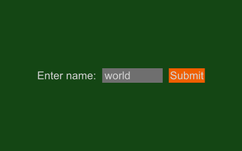

# Kredki

Vector graphics & GUI toolkit for Ruby. For creating images, simulations, simple games and applications.

## How it works:

The project is based on the [ThorVG](https://www.thorvg.org/) library for rendering and the [SDL](https://www.libsdl.org/) library for connecting with hardware and host OS. Main features:
- Binary files are included and loaded via FFI
- Memory is managed automatically
- Drawing is only triggered after scene changes
- GUI widgets are built from scratch in Ruby

## Installation:

Ruby 3.3 or newer is required.

```SHELL
gem install kredki
```

or:

```SHELL
git clone https://github.com/lpogic/kredki
cd kredki
rake install 
```

## Usage:

<table><tr><th>
Code
</th><th>
Output
</th></tr><tr><td>

```RUBY
require 'kredki'

window.wh! 400, 200

ellipse! xy: 50, wh: 100, fill: :red
rectangle! x: 150, y: 50, wh: 100, fill: :green
shape! x: 250, y: 50, wh: 100, fill: :blue do |w, h|
  xy! 0, h
  line! w / 2, 0
  line! w, h
end
```

</td><td>

</td></tr><tr><td>

```RUBY
require 'kredki'

window.wh! 400, 250
layout! :xcc
mi! 10

label! "Enter name:"
n = note! w: 100, content: "world"
button! "Submit", suit: :orange do
  on_click do
    puts "Hello #{n}!"
  end
end
```

</td><td>

</td></tr><tr><td>

```RUBY
require 'kredki/module' # embedded mode

decision = Kredki.run do
  layout! :ycc
  
  space! w: 100, layout: :ysc do
    radio! do
      item! "yes", checked: true
      item! "no"
      item! "perhaps"
    end
    space! wh: 5
    button! "Submit", w: 1r do
      on_click do
        application.return fd(:item!, :checked?).subject
      end
    end
  end
end

puts decision # => yes/no/perhaps
```

</td><td>

</td></tr></table>

For more check out [kredki/sample](./kredki/sample/).

## Updates:

- empty

## Notes:

- This project uses modified version of the [ThorVG](https://www.thorvg.org/) library source code available here: https://github.com/lpogic/thorvg/tree/thorvg-gui

## Contact

- discord: https://discord.gg/NNrcXKgB