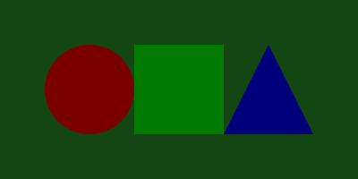
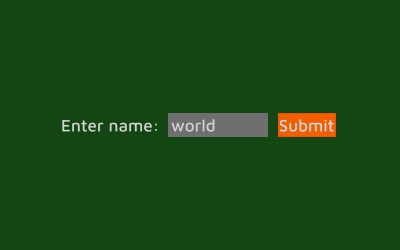
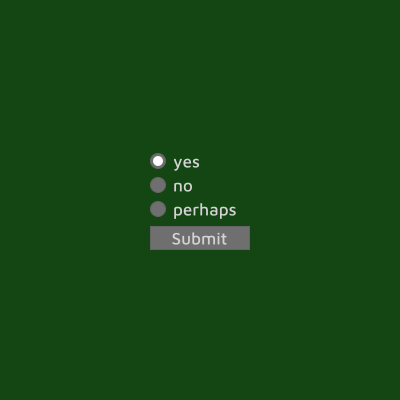

# :crayon::crayon::crayon: Kredki :crayon::crayon::crayon:

Vector graphics & GUI toolkit for [Ruby](https://www.ruby-lang.org/). For creating images, simulations, simple games and applications.

## How it works:

The project is based on the [ThorVG](https://www.thorvg.org/) library for rendering and the [SDL](https://www.libsdl.org/) library for connecting with hardware and operating system. Main features:
- no template languages, no style sheets - everything is written in Ruby
- redraws after scene changes only - saves computing power
- high level, object oriented API

## Installation:

Ruby 3.3 or newer is required.

```SHELL
gem install kredki
```

or:

```SHELL
git clone https://github.com/lpogic/kredki
cd kredki
rake install 
```

## Usage:

<table><tr><th>
Code
</th><th>
Output
</th></tr><tr><td>

```RUBY
require 'kredki'

window.size! 400, 200

ellipse! xy: 50, size: 100, fill: :red
rectangle! x: 150, y: 50, size: 100, fill: :green
shape! x: 250, y: 50, size: 100, fill: :blue do |sx, sy|
  xy! 0, sy
  line! sx / 2, 0
  line! sx, sy
end
```

</td><td>

</td></tr><tr><td>

```RUBY
require 'kredki'

window.size! 400, 250
layout! :xcc
spacer! 10

label! "Enter name:"
n = note! w: 100, text: "world"
button! "Submit", suit: :orange do
  on_click do
    puts "Hello #{n}!"
  end
end
```

</td><td>

</td></tr><tr><td>

```RUBY
require 'kredki/module' # embedded mode

decision = Kredki.app do
  ysc! size_x: 100 do
    radio! do
      item! "yes", checked: true
      item! "no"
      item! "perhaps"
    end
    space! size: 5
    button! "Submit", :$btn, size_x: 1r
  end

  $btn.on_click{ app.return find_upper(:item!, :checked?).subject }
end

puts decision # => yes/no/perhaps
```

</td><td>

</td></tr></table>

For more check out [kredki/sample](./kredki/sample/).

## Updates:

- Work in progress

## Contact

- discord: https://discord.gg/NNrcXKgB
- mail: oficjalnyadreslukasza@gmail.com